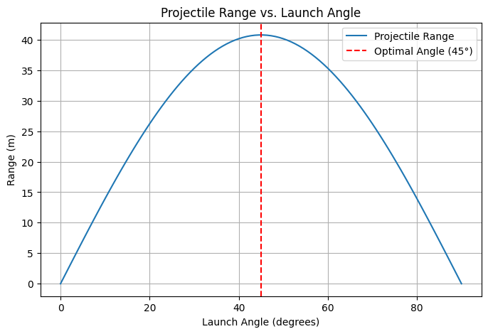

# Problem 1

1-1

1. Theoretical Derivation
   The equations of motion for projectile motion can be derived using Newton’s second law. Assuming no air resistance, the motion is governed by the kinematic equations:

Horizontal motion:

𝑥
(
𝑡
)
=
𝑣
0
cos
⁡
(
𝜃
)
𝑡
x(t)=v
0
​
cos(θ)t
(Constant velocity since no acceleration acts horizontally)

Vertical motion:

𝑦
(
𝑡
)
=
𝑣
0
sin
⁡
(
𝜃
)
𝑡
−
1
2
𝑔
𝑡
2
y(t)=v
0
​
sin(θ)t−
2
1
​
gt
2

(Acceleration due to gravity acts downward)

To determine range
𝑅
R, we find the time of flight by setting
𝑦
(
𝑡
)
=
0
y(t)=0:

𝑡
𝑓
=
2
𝑣
0
sin
⁡
(
𝜃
)
𝑔
t
f
​
=
g
2v
0
​
sin(θ)
​

Substituting this into the horizontal displacement equation:

# 𝑅

𝑣
0
cos
⁡
(
𝜃
)
⋅
2
𝑣
0
sin
⁡
(
𝜃
)
𝑔
R=v
0
​
cos(θ)⋅
g
2v
0
​
sin(θ)
​

Using the trigonometric identity
2
sin
⁡
(
𝜃
)
cos
⁡
(
𝜃
)
=
sin
⁡
(
2
𝜃
)
2sin(θ)cos(θ)=sin(2θ), we obtain:

# 𝑅

𝑣
0
2
𝑔
sin
⁡
(
2
𝜃
)
R=
g
v
0
2
​

​
sin(2θ)

---

1-2
. Theoretical Analysis of the Range
Governing Equations
Projectile motion is described by the kinematic equations for motion in two dimensions. Assuming no air resistance:

Horizontal displacement:

𝑥
(
𝑡
)
=
𝑣
0
cos
⁡
(
𝜃
)
𝑡
x(t)=v
0
​
cos(θ)t
Vertical displacement:

𝑦
(
𝑡
)
=
𝑣
0
sin
⁡
(
𝜃
)
𝑡
−
1
2
𝑔
𝑡
2
y(t)=v
0
​
sin(θ)t−
2
1
​
gt
2

where:

𝑣
0
v
0
​
is the initial velocity,

𝜃
θ is the launch angle,

𝑔
g is gravitational acceleration.

Time of Flight
Setting
𝑦
(
𝑡
)
=
0
y(t)=0 to determine the time the projectile spends in the air:

𝑡
𝑓
=
2
𝑣
0
sin
⁡
(
𝜃
)
𝑔
t
f
​
=
g
2v
0
​
sin(θ)
​

Range Equation
Substituting
𝑡
𝑓
t
f
​
into the horizontal displacement equation:

# 𝑅

𝑣
0
cos
⁡
(
𝜃
)
⋅
2
𝑣
0
sin
⁡
(
𝜃
)
𝑔
R=v
0
​
cos(θ)⋅
g
2v
0
​
sin(θ)
​

Using the trigonometric identity
2
sin
⁡
(
𝜃
)
cos
⁡
(
𝜃
)
=
sin
⁡
(
2
𝜃
)
2sin(θ)cos(θ)=sin(2θ), we obtain:

# 𝑅

𝑣
0
2
𝑔
sin
⁡
(
2
𝜃
)
R=
g
v
0
2
​

​
sin(2θ)

Analysis and Observations
The maximum range occurs at 45°, as expected from the range equation.

The range is symmetric about
45
∘
45
∘
, meaning angles like 30° and 60° result in the same range.

Increasing
𝑣
0
v
0
​
increases the range, while increasing
𝑔
g decreases it.

Limitations: This model assumes no air resistance, which in real-world scenarios would shift the optimal launch angle slightly lower.
