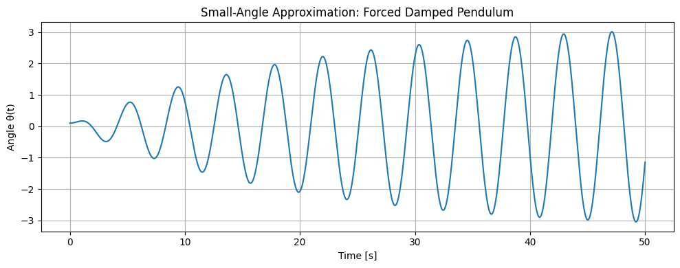
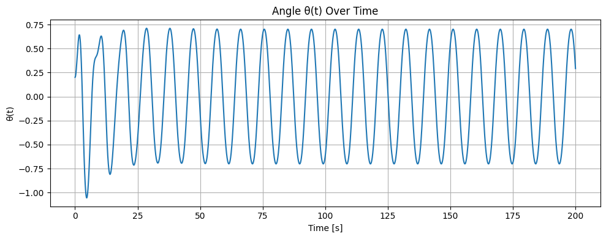
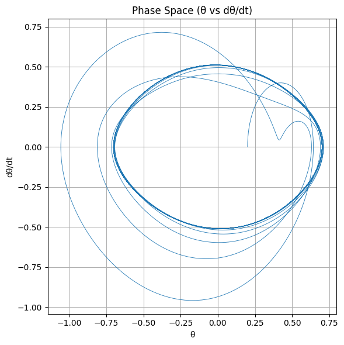
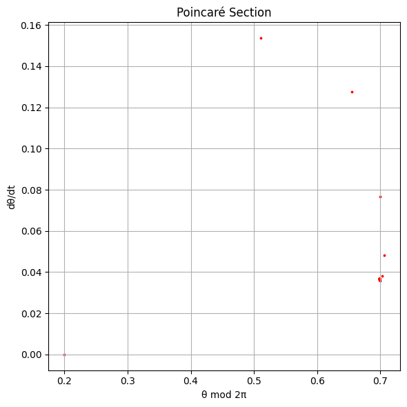

# Problem 2

2-1-1

1. Theoretical Foundation
   🧠 Governing Differential Equation:
   The forced damped pendulum is governed by the nonlinear second-order differential equation:

𝑑
2
𝜃
𝑑
𝑡
2

- 𝛾
  𝑑
  𝜃
  𝑑
  𝑡
- 𝜔
  0
  2
  sin
  ⁡
  (
  𝜃
  )
  =
  𝐴
  cos
  ⁡
  (
  𝜔
  𝑡
  )
  dt
  2

d
2
θ
​
+γ
dt
dθ
​
+ω
0
2
​
sin(θ)=Acos(ωt)
𝜃
(
𝑡
)
θ(t): Angular displacement

𝛾
γ: Damping coefficient

𝜔
0
=
𝑔
𝐿
ω
0
​
=
L
g
​

​
: Natural angular frequency

𝐴
A: Amplitude of the driving force

𝜔
ω: Frequency of the external driving force

🔍 Small-Angle Approximation:
When
𝜃
θ is small (
<
0.2

rad
<0.2rad), we can linearize the equation using:

sin
⁡
(
𝜃
)
≈
𝜃
sin(θ)≈θ
Thus, the equation becomes:

𝑑
2
𝜃
𝑑
𝑡
2

- 𝛾
  𝑑
  𝜃
  𝑑
  𝑡
- 𝜔
  0
  2
  𝜃
  =
  𝐴
  cos
  ⁡
  (
  𝜔
  𝑡
  )
  dt
  2

d
2
θ
​
+γ
dt
dθ
​
+ω
0
2
​
θ=Acos(ωt)
✅ Analytical Solution (General Form):
This is now a second-order linear non-homogeneous ODE. Its solution consists of:

𝜃
(
𝑡
)
=
𝜃
hom
(
𝑡
)

- 𝜃
  part
  (
  𝑡
  )
  θ(t)=θ
  hom
  ​
  (t)+θ
  part
  ​
  (t)
  📘 Homogeneous Solution (transient):
  𝜃
  hom
  (
  𝑡
  )
  =
  𝐶
  1
  𝑒
  −
  𝛾
  𝑡
  /
  2
  cos
  ⁡
  (
  𝜔
  𝑑
  𝑡
  )
- 𝐶
  2
  𝑒
  −
  𝛾
  𝑡
  /
  2
  sin
  ⁡
  (
  𝜔
  𝑑
  𝑡
  )
  θ
  hom
  ​
  (t)=C
  1
  ​
  e
  −γt/2
  cos(ω
  d
  ​
  t)+C
  2
  ​
  e
  −γt/2
  sin(ω
  d
  ​
  t)
  where
  𝜔
  𝑑
  =
  𝜔
  0
  2
  −
  (
  𝛾
  /
  2
  )
  2
  ω
  d
  ​
  =
  ω
  0
  2
  ​
  −(γ/2)
  2

​

📘 Particular Solution (steady-state):
𝜃
part
(
𝑡
)
=
𝐵
cos
⁡
(
𝜔
𝑡
−
𝜙
)
θ
part
​
(t)=Bcos(ωt−ϕ)
Where the amplitude
𝐵
B and phase shift
𝜙
ϕ are:

# 𝐵

𝐴
(
𝜔
0
2
−
𝜔
2
)
2

- 𝛾
  2
  𝜔
  2
  ,
  tan
  ⁡
  (
  𝜙
  )
  =
  𝛾
  𝜔
  𝜔
  0
  2
  −
  𝜔
  2
  B=
  (ω
  0
  2
  ​
  −ω
  2
  )
  2
  +γ
  2
  ω
  2

​

A
​
,tan(ϕ)=
ω
0
2
​
−ω
2

γω
​

🎯 Resonance Condition:
Maximum amplitude (resonance) occurs when the denominator of
𝐵
B is minimized:

𝜔
res
=
𝜔
0
2
−
𝛾
2
2
ω
res
​
=
ω
0
2
​
−
2
γ
2

​

​

This is where energy input from the external force is most efficiently transferred to the system.

2-1-2 2. Analysis of Dynamics (Summary)
The behavior of a forced damped pendulum depends on three main parameters:

Damping (
𝛾
γ):

Low damping allows sustained oscillations and sharp resonance.

High damping suppresses motion and reduces resonance.

Driving Amplitude (A):

Small amplitudes produce regular, periodic motion.

Large amplitudes can lead to complex or chaotic behavior.

Driving Frequency (
𝜔
ω):

When near the natural frequency, the system experiences resonance, with large oscillations.

Away from resonance, the system may still show periodic, quasiperiodic, or chaotic motion depending on
𝐴
A and
𝛾
γ.

As parameters change, the pendulum can transition from simple harmonic motion to chaos, often through a process called period doubling. These behaviors are best visualized using time series, phase portraits, and Poincaré sections.

