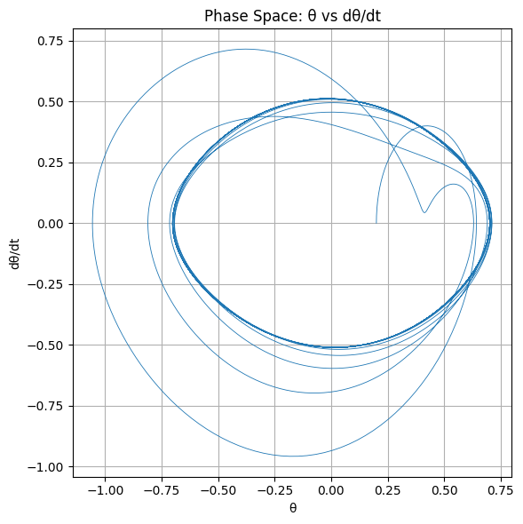
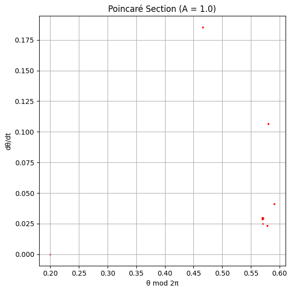
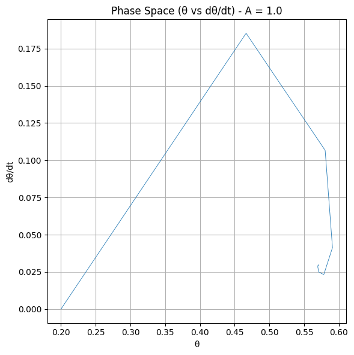

# Problem 2

2-1-1

1. Theoretical Foundation
   🧠 Governing Differential Equation:
   The forced damped pendulum is governed by the nonlinear second-order differential equation:

𝑑
2
𝜃
𝑑
𝑡
2

- 𝛾
  𝑑
  𝜃
  𝑑
  𝑡
- 𝜔
  0
  2
  sin
  ⁡
  (
  𝜃
  )
  =
  𝐴
  cos
  ⁡
  (
  𝜔
  𝑡
  )
  dt
  2

d
2
θ
​
+γ
dt
dθ
​
+ω
0
2
​
sin(θ)=Acos(ωt)
𝜃
(
𝑡
)
θ(t): Angular displacement

𝛾
γ: Damping coefficient

𝜔
0
=
𝑔
𝐿
ω
0
​
=
L
g
​

​
: Natural angular frequency

𝐴
A: Amplitude of the driving force

𝜔
ω: Frequency of the external driving force

🔍 Small-Angle Approximation:
When
𝜃
θ is small (
<
0.2

rad
<0.2rad), we can linearize the equation using:

sin
⁡
(
𝜃
)
≈
𝜃
sin(θ)≈θ
Thus, the equation becomes:

𝑑
2
𝜃
𝑑
𝑡
2

- 𝛾
  𝑑
  𝜃
  𝑑
  𝑡
- 𝜔
  0
  2
  𝜃
  =
  𝐴
  cos
  ⁡
  (
  𝜔
  𝑡
  )
  dt
  2

d
2
θ
​
+γ
dt
dθ
​
+ω
0
2
​
θ=Acos(ωt)
✅ Analytical Solution (General Form):
This is now a second-order linear non-homogeneous ODE. Its solution consists of:

𝜃
(
𝑡
)
=
𝜃
hom
(
𝑡
)

- 𝜃
  part
  (
  𝑡
  )
  θ(t)=θ
  hom
  ​
  (t)+θ
  part
  ​
  (t)
  📘 Homogeneous Solution (transient):
  𝜃
  hom
  (
  𝑡
  )
  =
  𝐶
  1
  𝑒
  −
  𝛾
  𝑡
  /
  2
  cos
  ⁡
  (
  𝜔
  𝑑
  𝑡
  )
- 𝐶
  2
  𝑒
  −
  𝛾
  𝑡
  /
  2
  sin
  ⁡
  (
  𝜔
  𝑑
  𝑡
  )
  θ
  hom
  ​
  (t)=C
  1
  ​
  e
  −γt/2
  cos(ω
  d
  ​
  t)+C
  2
  ​
  e
  −γt/2
  sin(ω
  d
  ​
  t)
  where
  𝜔
  𝑑
  =
  𝜔
  0
  2
  −
  (
  𝛾
  /
  2
  )
  2
  ω
  d
  ​
  =
  ω
  0
  2
  ​
  −(γ/2)
  2

​

📘 Particular Solution (steady-state):
𝜃
part
(
𝑡
)
=
𝐵
cos
⁡
(
𝜔
𝑡
−
𝜙
)
θ
part
​
(t)=Bcos(ωt−ϕ)
Where the amplitude
𝐵
B and phase shift
𝜙
ϕ are:

# 𝐵

𝐴
(
𝜔
0
2
−
𝜔
2
)
2

- 𝛾
  2
  𝜔
  2
  ,
  tan
  ⁡
  (
  𝜙
  )
  =
  𝛾
  𝜔
  𝜔
  0
  2
  −
  𝜔
  2
  B=
  (ω
  0
  2
  ​
  −ω
  2
  )
  2
  +γ
  2
  ω
  2

​

A
​
,tan(ϕ)=
ω
0
2
​
−ω
2

γω
​

🎯 Resonance Condition:
Maximum amplitude (resonance) occurs when the denominator of
𝐵
B is minimized:

𝜔
res
=
𝜔
0
2
−
𝛾
2
2
ω
res
​
=
ω
0
2
​
−
2
γ
2

​

​

This is where energy input from the external force is most efficiently transferred to the system.

2-1-2 2. Analysis of Dynamics (Summary)
The behavior of a forced damped pendulum depends on three main parameters:

Damping (
𝛾
γ):

Low damping allows sustained oscillations and sharp resonance.

High damping suppresses motion and reduces resonance.

Driving Amplitude (A):

Small amplitudes produce regular, periodic motion.

Large amplitudes can lead to complex or chaotic behavior.

Driving Frequency (
𝜔
ω):

When near the natural frequency, the system experiences resonance, with large oscillations.

Away from resonance, the system may still show periodic, quasiperiodic, or chaotic motion depending on
𝐴
A and
𝛾
γ.

As parameters change, the pendulum can transition from simple harmonic motion to chaos, often through a process called period doubling. These behaviors are best visualized using time series, phase portraits, and Poincaré sections.

2-1-3 3. Practical Applications
The forced damped pendulum model has practical relevance in several real-world systems where oscillations under damping and external forcing are important:

Energy Harvesting Devices:
The model is used in devices designed to capture energy from mechanical vibrations, where the pendulum’s motion can be tuned for optimal energy extraction under periodic forces.

Suspension Bridges:
Forced damped oscillations are critical in understanding the behavior of suspension bridges under periodic wind forces or traffic loads, especially in resonance conditions which can lead to structural failure.

Oscillating Circuits:
In electronics, driven RLC circuits (resistor-inductor-capacitor) exhibit similar behavior to a forced damped pendulum, making the model applicable for analyzing resonance and damping in circuits.

Biomechanics (Human Gait):
The model can be adapted to understand human locomotion, where damping and periodic forces (from walking) interact. It can help in the design of prosthetics or the study of movement disorders.

2-1-4 4. Implementation
Objective:
In this section, we'll focus on creating advanced simulations of the forced damped pendulum system. This includes:

Bifurcation diagrams to explore how system behavior changes with varying parameters.

Poincaré sections to reveal chaotic dynamics.

Phase portraits to visualize the trajectories in phase space.

Bifurcation Diagram:
A bifurcation diagram is a powerful tool to visualize how the long-term behavior of a system (like the forced damped pendulum) changes as a parameter (typically the driving amplitude
𝐴
A) is varied. This reveals transitions from periodic motion to chaotic behavior, showing the "route to chaos" (period doubling).

Poincaré Section:
This tool helps to analyze periodic, quasiperiodic, and chaotic dynamics by sampling the system at fixed intervals of the driving period. The structure of the Poincaré section helps identify whether the system follows regular oscillations or chaotic motion.

Phase Portrait:
In phase space (
𝜃
,
𝜃
˙
θ,
θ
˙
), the system's trajectory provides insights into its dynamics. A limit cycle indicates regular oscillation, while chaotic systems show erratic, non-repeating paths.

