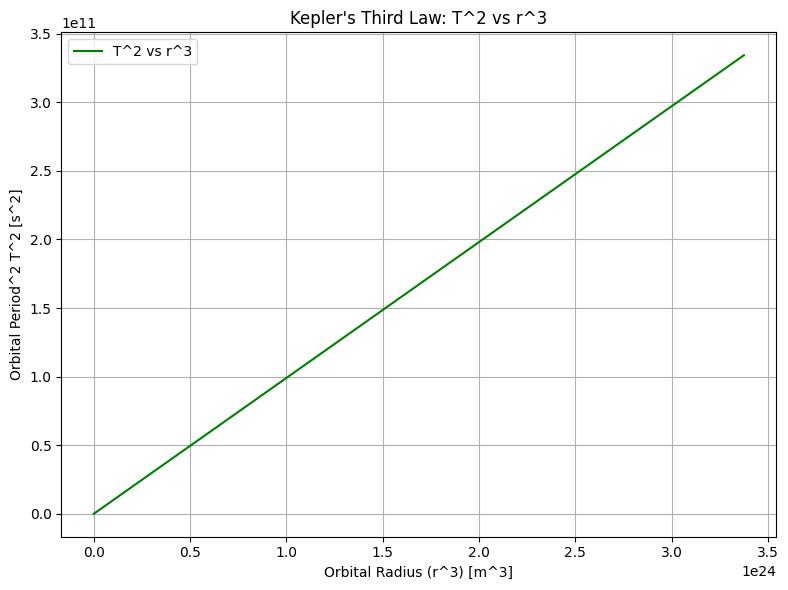
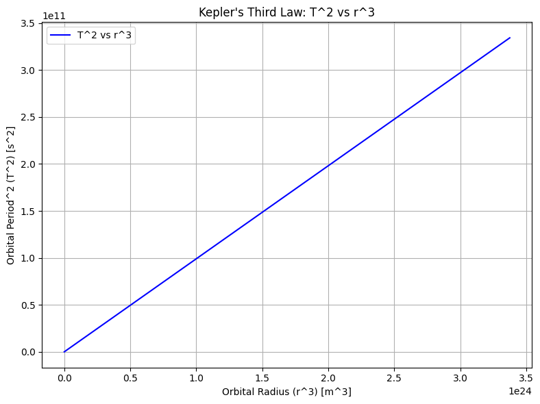
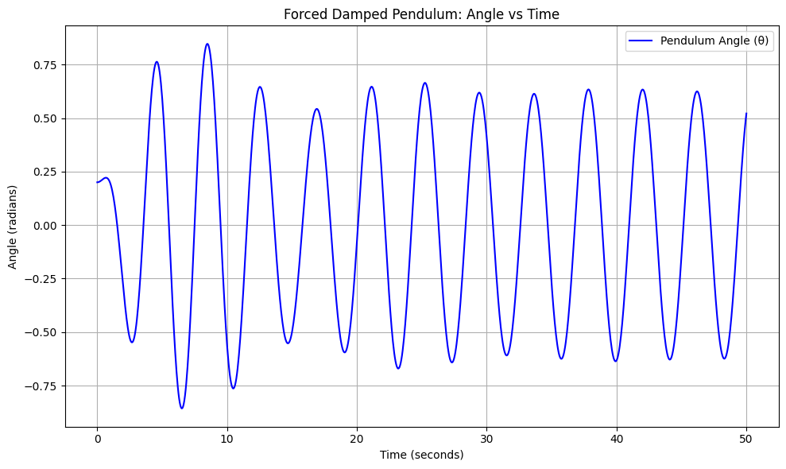
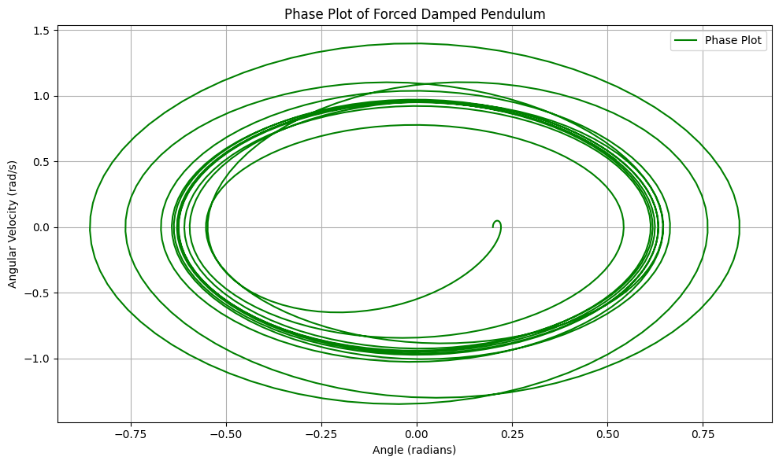

# Problem 1

1-1

1. Derivation of Kepler's Third Law for Circular Orbits (with Code)
   Kepler's Third Law for circular orbits states that the square of the orbital period
   𝑇
   T is proportional to the cube of the orbital radius
   𝑟
   r, i.e.,

𝑇
2
∝
𝑟
3
T
2
∝r
3

We derived this relationship using Newton's Law of Gravitation and centripetal force.

Steps:
Gravitational Force:
The gravitational force between two bodies is given by:

# 𝐹

𝐺
𝑀
𝑚
𝑟
2
F=
r
2

GMm
​

where:

𝐺
G is the gravitational constant,

𝑀
M is the mass of the central body,

𝑚
m is the mass of the orbiting object,

𝑟
r is the distance between the two bodies.

1-2
Summary of Kepler's Third Law Implications:
Kepler's Third Law states that the square of the orbital period
𝑇
2
T
2
is proportional to the cube of the orbital radius
𝑟
3
r
3
. This has key implications in astronomy:

Longer Periods for Larger Orbits: Objects farther from the central body have longer orbital periods. This helps explain why outer planets take much longer to orbit the Sun than inner planets.

Predicting Orbital Characteristics: Kepler's Third Law enables the calculation of orbital periods and distances for celestial bodies, helping us understand their motion and behavior.

Determining Central Masses: If we know the orbital period and radius, we can calculate the mass of the central object (e.g., Earth, Sun) using the rearranged formula:

# 𝑀

4
𝜋
2
𝑟
3
𝐺
𝑇
2
M=
GT
2

4π
2
r
3

​

Real-World Example: The Moon's orbit around Earth is an example. Using its orbital radius and period, we can estimate the Earth's mass.

1-3
Derivation and Formula (Kepler's Third Law)
Kepler’s Third Law relates the square of the orbital period
𝑇
2
T
2
to the cube of the orbital radius
𝑟
3
r
3
, for circular orbits. The law is mathematically expressed as:

𝑇
2
∝
𝑟
3
T
2
∝r
3

More precisely, for any two objects orbiting the same central body, we can express the relationship as:

𝑇
1
2
𝑇
2
2
=
𝑟
1
3
𝑟
2
3
T
2
2
​

T
1
2
​

​
=
r
2
3
​

r
1
3
​

​

Where:

𝑇
1
T
1
​
and
𝑇
2
T
2
​
are the orbital periods of two objects.

𝑟
1
r
1
​
and
𝑟
2
r
2
​
are the orbital radii of the two objects.

Gravitational Formulation for Orbital Period:
The orbital period for an object orbiting a central mass
𝑀
M can be derived from Newton's law of gravitation and is given by the formula:

# 𝑇

2
𝜋
𝑟
3
𝐺
𝑀
T=2π
GM
r
3

​

​

Where:

𝑇
T is the orbital period,

𝑟
r is the orbital radius (distance from the central object),

𝐺
G is the gravitational constant,

𝑀
M is the mass of the central object (e.g., the Sun or Earth).

This formula allows us to calculate the orbital period if we know the orbital radius and the mass of the central body.

1-4
4.1 Derivation of the Equation for a Forced Damped Pendulum
A forced damped pendulum is a system where a pendulum experiences both damping forces and an external periodic driving force. The governing differential equation for the system is:

𝑑
2
𝜃
𝑑
𝑡
2

- 2
  𝛾
  𝑑
  𝜃
  𝑑
  𝑡
- 𝜔
  0
  2
  sin
  ⁡
  (
  𝜃
  )
  =
  𝐹
  0
  cos
  ⁡
  (
  𝜔
  𝑡
  )
  dt
  2

d
2
θ
​
+2γ
dt
dθ
​
+ω
0
2
​
sin(θ)=F
0
​
cos(ωt)
Where:

𝜃
(
𝑡
)
θ(t) is the angle of the pendulum at time
𝑡
t,

𝛾
γ is the damping coefficient,

𝜔
0
ω
0
​
is the natural frequency of the pendulum (without damping and forcing),

𝐹
0
F
0
​
is the amplitude of the external driving force,

𝜔
ω is the frequency of the external driving force.

For small-angle oscillations (where
sin
⁡
(
𝜃
)
≈
𝜃
sin(θ)≈θ), the equation becomes:

𝑑
2
𝜃
𝑑
𝑡
2

- 2
  𝛾
  𝑑
  𝜃
  𝑑
  𝑡
- 𝜔
  0
  2
  𝜃
  =
  𝐹
  0
  cos
  ⁡
  (
  𝜔
  𝑡
  )
  dt
  2

d
2
θ
​
+2γ
dt
dθ
​
+ω
0
2
​
θ=F
0
​
cos(ωt)
This is a second-order linear differential equation that describes the motion of the damped and driven pendulum.

Key Behavior:
Resonance: When the driving frequency
𝜔
ω matches the natural frequency
𝜔
0
ω
0
​
, the system experiences resonance, leading to large oscillations.

Damping: The damping term
2
𝛾
𝑑
𝜃
𝑑
𝑡
2γ
dt
dθ
​
causes the amplitude of the oscillations to decrease over time, depending on the value of
𝛾
γ.

4.2 Numerical Simulation of the Forced Damped Pendulum
We can numerically simulate the motion of the forced damped pendulum using the Runge-Kutta method to solve the differential equation.

