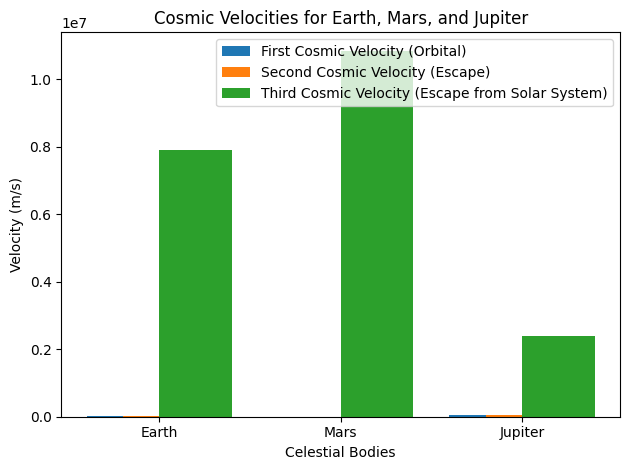
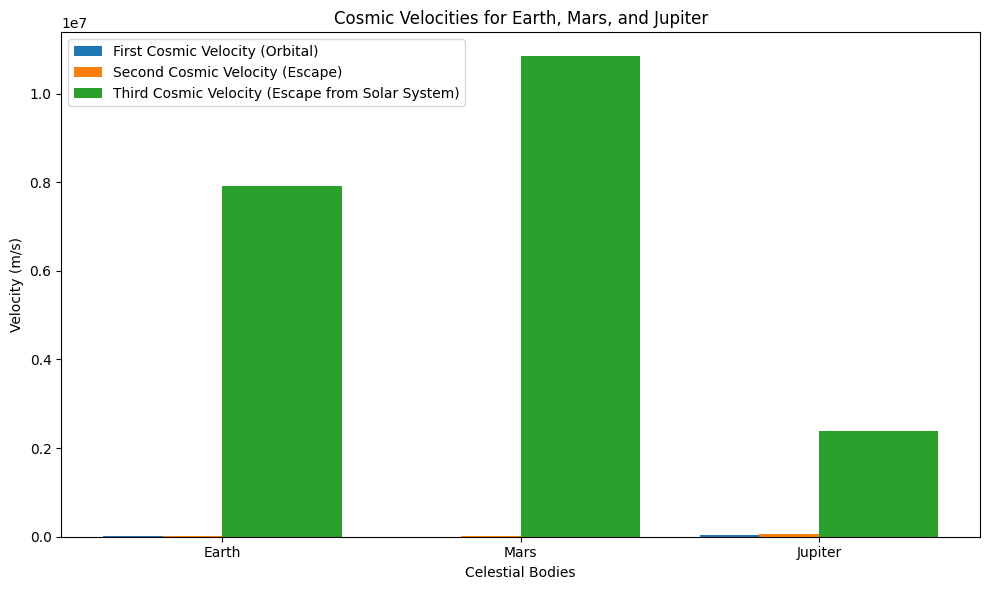
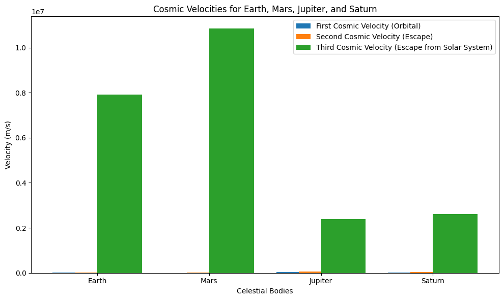

# Problem 2

Task 1: Cosmic Velocities (Summary & Code)
2-1
First Cosmic Velocity (Orbital Velocity): The velocity required for an object to stay in a stable orbit around a celestial body.

𝑣
1
=
𝐺
𝑀
𝑟
v
1
​
=
r
GM
​

​

Second Cosmic Velocity (Escape Velocity): The velocity required to escape the gravitational pull of a celestial body.

𝑣
2
=
2
𝐺
𝑀
𝑟
v
2
​
=
r
2GM
​

​

Third Cosmic Velocity (Escape from Solar System): The velocity required to escape the gravitational influence of the solar system.

𝑣
3
=
3
𝐺
𝑀
sun
𝑟
v
3
​
=
r
3GM
sun
​

​

​

2-2
task 2 ve dusturu ve kodu ver
ChatGPT:
Task 2: Escape Velocities and Cosmic Velocities
2.1 Definitions and Physical Meaning:
The escape velocity is the minimum velocity an object needs to escape the gravitational influence of a celestial body, without further propulsion. The three cosmic velocities are:

First Cosmic Velocity (Orbital Velocity): The velocity needed to stay in a stable orbit around a celestial body.

Second Cosmic Velocity (Escape Velocity): The velocity needed to escape the gravitational influence of a celestial body (e.g., Earth, Mars, Jupiter).

Third Cosmic Velocity (Escape from Solar System): The velocity needed to escape the gravitational pull of the entire solar system.

2.2 Mathematical Derivations:
First Cosmic Velocity:

𝑣
1
=
𝐺
𝑀
𝑟
v
1
​
=
r
GM
​

​

Where:

𝐺
G = Gravitational constant

𝑀
M = Mass of the celestial body

𝑟
r = Distance from the center of the celestial body (orbital radius)

Second Cosmic Velocity:

𝑣
2
=
2
𝐺
𝑀
𝑟
v
2
​
=
r
2GM
​

​

Third Cosmic Velocity:

𝑣
3
=
3
𝐺
𝑀
sun
𝑟
v
3
​
=
r
3GM
sun
​

​

​

2-3
3.1 Definitions and Physical Meaning:
This task builds on the previously defined concepts of escape velocity and cosmic velocities. The cosmic velocities are critical for understanding how to leave the gravitational influence of various celestial bodies:

First Cosmic Velocity: Orbital velocity needed to stay in a stable orbit around a celestial body.

Second Cosmic Velocity: Escape velocity needed to break free from the gravitational pull of a celestial body.

Third Cosmic Velocity: Escape velocity needed to leave the gravitational influence of the solar system.

These velocities depend on two primary parameters:

Mass of the celestial body (more massive bodies require higher velocities to escape).

Radius of the celestial body (closer distances to the center of the body require higher velocities).

3.2 Parameters and Formulae:
Orbital Velocity (v₁):

𝑣
1
=
𝐺
𝑀
𝑟
v
1
​
=
r
GM
​

​

Where:

𝐺
G = Gravitational constant

𝑀
M = Mass of the celestial body

𝑟
r = Orbital radius

Escape Velocity (v₂):

𝑣
2
=
2
𝐺
𝑀
𝑟
v
2
​
=
r
2GM
​

​

Solar System Escape Velocity (v₃):

𝑣
3
=
3
𝐺
𝑀
sun
𝑟
v
3
​
=
r
3GM
sun
​

​

​

