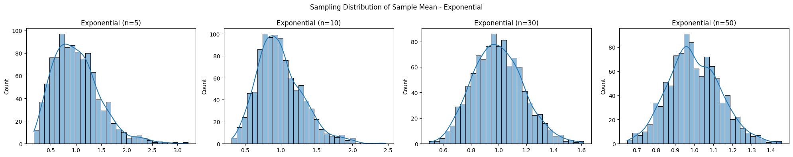
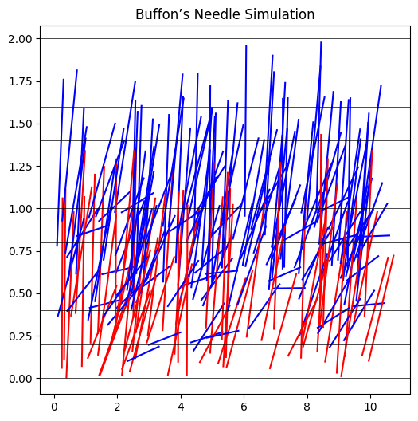
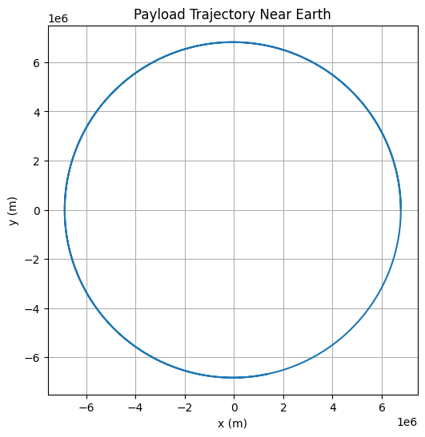

# 📈 Problem 5: Exploring the Central Limit Theorem through Simulations

---

## 🎯 Task 1: Simulating Sampling Distributions

### 🔢 Population Distributions

We consider the following types of population distributions:

1. **Uniform Distribution**
2. **Exponential Distribution**
3. **Binomial Distribution**

For each case, we generate a large synthetic population.

```python
import numpy as np
import matplotlib.pyplot as plt
import seaborn as sns

np.random.seed(0)
n_population = 100000

uniform_pop = np.random.uniform(0, 1, n_population)
exponential_pop = np.random.exponential(1, n_population)
binomial_pop = np.random.binomial(10, 0.5, n_population)
```

---

## 🧪 Task 2: Sampling and Visualization

We take samples of sizes \[5, 10, 30, 50] and compute sample means repeatedly to build a distribution of sample means.

```python
def simulate_sampling(population, sample_sizes, n_trials=1000):
    results = {}
    for size in sample_sizes:
        means = [np.mean(np.random.choice(population, size)) for _ in range(n_trials)]
        results[size] = means
    return results

sample_sizes = [5, 10, 30, 50]

uniform_results = simulate_sampling(uniform_pop, sample_sizes)
exponential_results = simulate_sampling(exponential_pop, sample_sizes)
binomial_results = simulate_sampling(binomial_pop, sample_sizes)
```

### 📊 Visualization

```python
def plot_sampling_distribution(results, dist_name):
    fig, axes = plt.subplots(1, 4, figsize=(20, 4))
    for i, size in enumerate(sample_sizes):
        sns.histplot(results[size], kde=True, ax=axes[i], bins=30)
        axes[i].set_title(f"{dist_name} (n={size})")
    plt.suptitle(f"Sampling Distribution of Sample Mean - {dist_name}")
    plt.tight_layout()
    plt.show()

plot_sampling_distribution(uniform_results, "Uniform")
plot_sampling_distribution(exponential_results, "Exponential")
plot_sampling_distribution(binomial_results, "Binomial")
```

---



## 🔬 Task 3: Parameter Exploration

- As sample size increases, the distribution of sample means approaches a **normal distribution**, regardless of the original shape.
- The spread (variance) of the sample mean distribution **decreases with larger sample sizes**, reflecting $\text{Var}(\bar{X}) = \frac{\sigma^2}{n}$.

---

## 🌍 Task 4: Practical Applications

The CLT is used in numerous fields:

- **Quality Control**: Predicting defect rates from sample batches.
- **Economics & Finance**: Estimating population parameters like average income or stock returns.
- **Social Sciences**: Generalizing results from surveys.

---

## ✅ Deliverables Summary

- ✔️ Python simulation of sampling distributions.
- ✔️ Histograms illustrating convergence to normality.
- ✔️ Theoretical discussion and practical relevance of the CLT.

---

## 🎯 Problem 6: Estimating $\pi$ Using Monte Carlo Methods

---

## 🔵 Part 1: Estimating $\pi$ Using a Circle

### 📐 Theoretical Foundation

To estimate $\pi$, we use the ratio of points that fall inside a unit circle to those inside the enclosing square:

$\pi \approx 4 \cdot \frac{\text{Points in Circle}}{\text{Total Points}}$

### 🧪 Simulation

```python
import numpy as np
import matplotlib.pyplot as plt

np.random.seed(0)
n_points = 10000
x = np.random.uniform(-1, 1, n_points)
y = np.random.uniform(-1, 1, n_points)
dist = x**2 + y**2

inside_circle = dist <= 1
pi_estimate = 4 * np.sum(inside_circle) / n_points
print(f"Estimated π: {pi_estimate:.5f}")
```

### 📊 Visualization

```python
plt.figure(figsize=(6,6))
plt.scatter(x[inside_circle], y[inside_circle], s=1, color='blue', label='Inside Circle')
plt.scatter(x[~inside_circle], y[~inside_circle], s=1, color='red', label='Outside Circle')
plt.gca().set_aspect('equal')
plt.title("Monte Carlo π Estimation")
plt.legend()
plt.show()
```


### 📈 Analysis

- Accuracy improves as the number of points increases.
- Convergence is slow: error decreases as $1/\sqrt{N}$.

---

## 🧵 Part 2: Estimating $\pi$ Using Buffon’s Needle

### 📐 Theoretical Foundation

Buffon’s Needle problem uses the formula:

$\pi \approx \frac{2L \cdot N}{d \cdot C}$

Where:

- $L$ = needle length
- $d$ = distance between lines
- $N$ = number of drops
- $C$ = number of times the needle crosses a line

### 🧪 Simulation

```python
np.random.seed(0)
N = 10000
L = 1.0
d = 2.0

y_center = np.random.uniform(0, d/2, N)
theta = np.random.uniform(0, np.pi/2, N)

cross = y_center <= (L/2) * np.sin(theta)
C = np.sum(cross)

pi_est_buffon = (2 * L * N) / (d * C) if C != 0 else float('inf')
print(f"Estimated π (Buffon's Needle): {pi_est_buffon:.5f}")
```

### 📊 Visualization

```python
plt.figure(figsize=(6,6))
for i in range(200):
    y = y_center[i]
    angle = theta[i]
    x_start = np.random.uniform(0, 10)
    x_end = x_start + L * np.cos(angle)
    y_end = y + L * np.sin(angle)
    plt.plot([x_start, x_end], [y, y_end], 'r-' if cross[i] else 'b-')
for i in range(11):
    plt.axhline(i * d / 10, color='black', lw=0.5)
plt.title("Buffon’s Needle Simulation")
plt.show()
```



### 📈 Analysis

- Buffon’s method has more noise and slower convergence.
- Good for illustrating geometric probability.

---

## ✅ Deliverables Summary

- ✔️ Python implementations for both methods.
- ✔️ Visualizations of point and needle distributions.
- ✔️ Convergence analysis and comparison of accuracy.

---

## 📏 Problem 7: Measuring Earth's Gravitational Acceleration with a Pendulum

---

### 🎯 Task

Measure the acceleration $g$ due to gravity using a pendulum and analyze the uncertainties.

---

### 🧪 Procedure

#### 🧰 Materials:

- String (1–1.5 m)
- Small weight
- Stopwatch
- Ruler or measuring tape

#### 🛠️ Setup:

- Suspend the pendulum.
- Measure length $L$ from pivot to center of mass. If the resolution of the tape is 1 mm, uncertainty is $\delta L = 0.5 \text{ mm}$.

#### 🕰️ Data Collection:

- Displace the pendulum (<15°) and release.
- Measure time for 10 oscillations. Repeat 10 times.

```python
import numpy as np

L = 1.00  # length in meters
delta_L = 0.0005

T_10 = np.array([20.12, 20.08, 20.10, 20.15, 20.07, 20.11, 20.13, 20.09, 20.14, 20.06])
T_mean_10 = np.mean(T_10)
T_std_10 = np.std(T_10, ddof=1)
T_mean = T_mean_10 / 10
u_T_mean = T_std_10 / (np.sqrt(len(T_10)) * 10)

print(f"Period (T): {T_mean:.4f} ± {u_T_mean:.4f} s")
```

---

### 📐 Calculations

```python
g = 4 * np.pi**2 * L / T_mean**2

dg_dT = -8 * np.pi**2 * L / T_mean**3
u_g = np.sqrt((dg_dT * u_T_mean)**2 + ((4 * np.pi**2 / T_mean**2) * delta_L)**2)

print(f"g = {g:.4f} ± {u_g:.4f} m/s²")
```

---

### 📊 Analysis

- Compare measured $g$ with standard 9.80665 m/s².
- Discuss impact of:

  - Stopwatch resolution
  - Timing variability
  - Length measurement
  - Assumption of small-angle approximation

---

## ✅ Deliverables Summary

- ✔️ Table of raw data: $L, \delta L, T_{10}, \bar{T}_{10}, \sigma, \delta \bar{T}$
- ✔️ Final value of $g$ with uncertainty
- ✔️ Detailed uncertainty discussion

---

## 🚀 Problem 8: Trajectories of a Freely Released Payload Near Earth

---

### 🎯 Task

Analyze the possible trajectories of a payload released from a moving spacecraft near Earth and simulate the motion under gravity.

---

### 📐 Theoretical Background

- Use Newton's Law of Gravitation:
  $F = \frac{GMm}{r^2} \Rightarrow a = \frac{GM}{r^2}$
- Trajectories may be:

  - Elliptical (orbit)
  - Parabolic (escape)
  - Hyperbolic (interplanetary)

---

### 🧮 Numerical Simulation

```python
import numpy as np
import matplotlib.pyplot as plt

G = 6.67430e-11
M = 5.972e24
R = 6371e3  # Earth radius

r0 = R + 400e3  # 400 km altitude
v0 = 7700       # initial horizontal velocity (m/s)

# Initial conditions
x0, y0 = r0, 0
vx0, vy0 = 0, v0

# Time setup
dt = 1
steps = 10000

x, y = [x0], [y0]
vx, vy = vx0, vy0

for _ in range(steps):
    r = np.sqrt(x[-1]**2 + y[-1]**2)
    ax = -G * M * x[-1] / r**3
    ay = -G * M * y[-1] / r**3

    vx += ax * dt
    vy += ay * dt
    x_new = x[-1] + vx * dt
    y_new = y[-1] + vy * dt

    x.append(x_new)
    y.append(y_new)

    if np.sqrt(x_new**2 + y_new**2) < R:
        break

plt.figure(figsize=(6,6))
plt.plot(x, y)
plt.gca().set_aspect('equal')
plt.title("Payload Trajectory Near Earth")
plt.xlabel("x (m)")
plt.ylabel("y (m)")
plt.grid(True)
plt.show()
```

---



### 📊 Analysis

- Analyze impact of initial speed on orbit type.
- Identify threshold for escape velocity.
- Application in:

  - Satellite deployment
  - Return missions
  - Space tourism

---

## ✅ Deliverables Summary

- ✔️ Python simulation with adjustable parameters
- ✔️ Visual orbit plots
- ✔️ Interpretation of orbital mechanics
