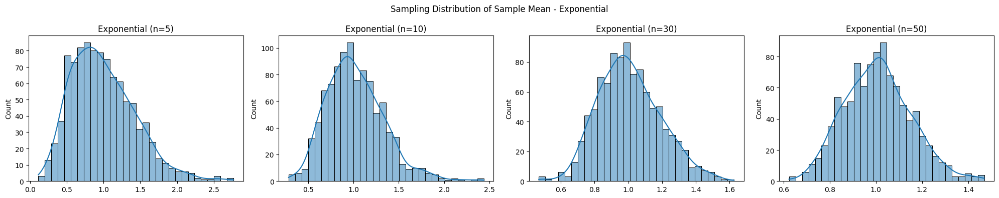

# Problem 1

# 📈 Problem 5: Exploring the Central Limit Theorem through Simulations

---

## 🎯 Task 1: Simulating Sampling Distributions

### 🔢 Population Distributions

We consider the following types of population distributions:

1. **Uniform Distribution**
2. **Exponential Distribution**
3. **Binomial Distribution**

For each case, we generate a large synthetic population.

```python
import numpy as np
import matplotlib.pyplot as plt
import seaborn as sns

np.random.seed(0)
n_population = 100000

uniform_pop = np.random.uniform(0, 1, n_population)
exponential_pop = np.random.exponential(1, n_population)
binomial_pop = np.random.binomial(10, 0.5, n_population)
```

---

## 🧪 Task 2: Sampling and Visualization

We take samples of sizes \[5, 10, 30, 50] and compute sample means repeatedly to build a distribution of sample means.

```python
def simulate_sampling(population, sample_sizes, n_trials=1000):
    results = {}
    for size in sample_sizes:
        means = [np.mean(np.random.choice(population, size)) for _ in range(n_trials)]
        results[size] = means
    return results

sample_sizes = [5, 10, 30, 50]

uniform_results = simulate_sampling(uniform_pop, sample_sizes)
exponential_results = simulate_sampling(exponential_pop, sample_sizes)
binomial_results = simulate_sampling(binomial_pop, sample_sizes)
```

### 📊 Visualization

```python
def plot_sampling_distribution(results, dist_name):
    fig, axes = plt.subplots(1, 4, figsize=(20, 4))
    for i, size in enumerate(sample_sizes):
        sns.histplot(results[size], kde=True, ax=axes[i], bins=30)
        axes[i].set_title(f"{dist_name} (n={size})")
    plt.suptitle(f"Sampling Distribution of Sample Mean - {dist_name}")
    plt.tight_layout()
    plt.show()

plot_sampling_distribution(uniform_results, "Uniform")
plot_sampling_distribution(exponential_results, "Exponential")
plot_sampling_distribution(binomial_results, "Binomial")
```

---



## 🔬 Task 3: Parameter Exploration

- As sample size increases, the distribution of sample means approaches a **normal distribution**, regardless of the original shape.
- The spread (variance) of the sample mean distribution **decreases with larger sample sizes**, reflecting $\text{Var}(\bar{X}) = \frac{\sigma^2}{n}$.

---

## 🌍 Task 4: Practical Applications

The CLT is used in numerous fields:

- **Quality Control**: Predicting defect rates from sample batches.
- **Economics & Finance**: Estimating population parameters like average income or stock returns.
- **Social Sciences**: Generalizing results from surveys.

---

## ✅ Deliverables Summary

- ✔️ Python simulation of sampling distributions.
- ✔️ Histograms illustrating convergence to normality.
- ✔️ Theoretical discussion and practical relevance of the CLT.

---
